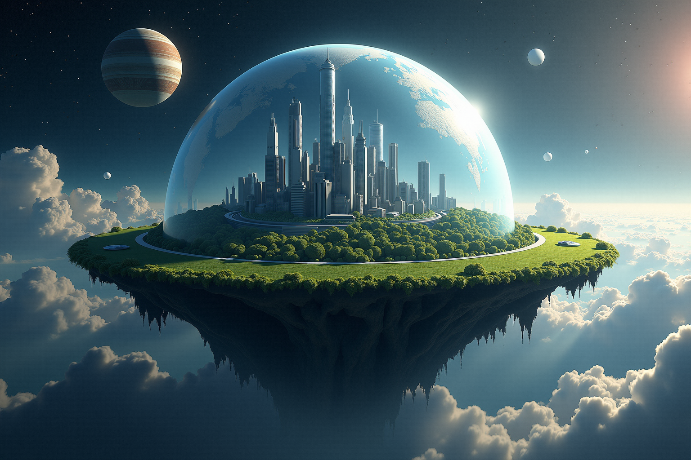

# Huge Image Generation Tool



This repository contains a command-line interface (CLI) tool for generating images using the FLUX model, with optional super-resolution capabilities. The tool leverages the power of the FLUX model for image generation and RealESRGAN for super-resolution upscaling.

## Features

- Generate images using the FLUX model
- Customize image dimensions, guidance scale, and number of inference steps
- Generate multiple images with a single command
- Apply super-resolution upscaling (2x, 4x, or 8x) using RealESRGAN
- Reproducible results with seed control

## Requirements

- Python 3.7+
- PyTorch
- Hugging Face `diffusers` library
- RealESRGAN

## Installation

1. Clone this repository:
   ```
   git clone https://github.com/ronreiter/hugeai.git
   cd hugeai
   ```

2. Install the required packages:
   ```
   poetry install
   ```

3.Set up your Hugging Face token (FLUX.dev requires a token):
   - Create a `.env` file in the project root
   - Add your Hugging Face token: `HF_TOKEN=your_token_here`

## Usage

Run the script with the following command:

```
python flux_cli_tool.py "your prompt here" [options]
```

### Options

- `--width`: Image width (default: 1536)
- `--height`: Image height (default: 1024)
- `--iterations`: Number of inference steps (default: 30)
- `--guidance`: Guidance scale (default: 3.5)
- `--seed`: Starting seed for image generation (default: random)
- `--num`: Number of images to generate (incrementing seed) (default: 1)
- `--sr`: Super resolution scale (2, 4, or 8)

### Example

Generate 10 images with a specific prompt and default settings (1536x1024, 2.5 guidance scale, 50 iterations, 8x super-resolution, seeds 2000-2010):

```
poetry run python hugeai.py "futuristic city, industrial, cyberpunk, midnight, stars, huge planets, milky way galaxy in sky, lake, reflection, photo-realistic, ultra realism, vivid colorful lights, cyberpunk space marine holding futuristic rail gun watching the city from afar" --guidance 3.5 --num 10 --seed 2000 --sr 8
```

To generate the cover photo, use:

```
poetry run python hugeai.py "ultra realistic, photo realistic, futuristic cityscape metropolis with vegitation on a round surface in space inside a glass spherical dome, galaxies, stars, fantasy sci-fi, huge planets" --num 20 --guidance 5
```

## Output

Generated images are saved in the `outputs` directory.

## Notes

- The tool uses MPS (Metal Performance Shaders) for GPU acceleration on compatible Mac devices.
- Super-resolution is applied after the initial image generation, so the specified dimensions are for the pre-upscaled image.

## Contributing

Contributions are welcome! Please feel free to submit a Pull Request.

## License

MIT
